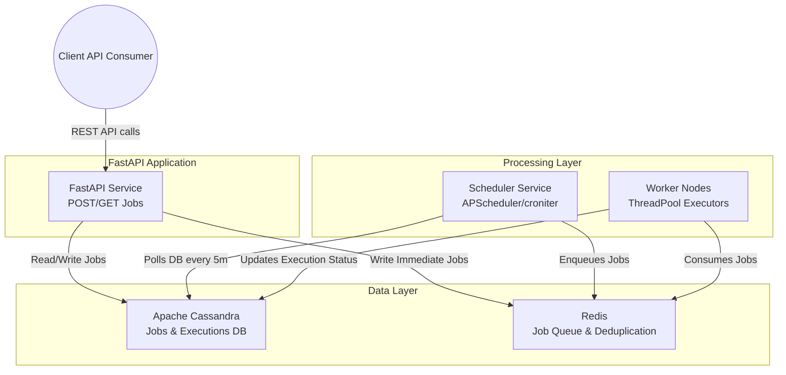
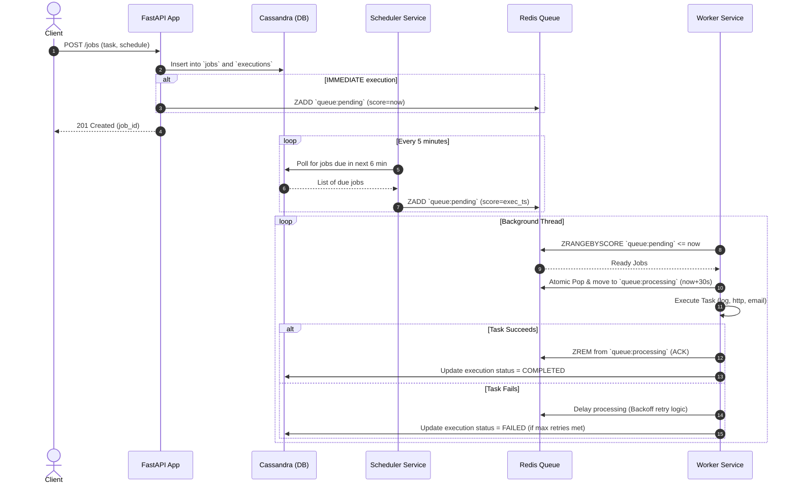
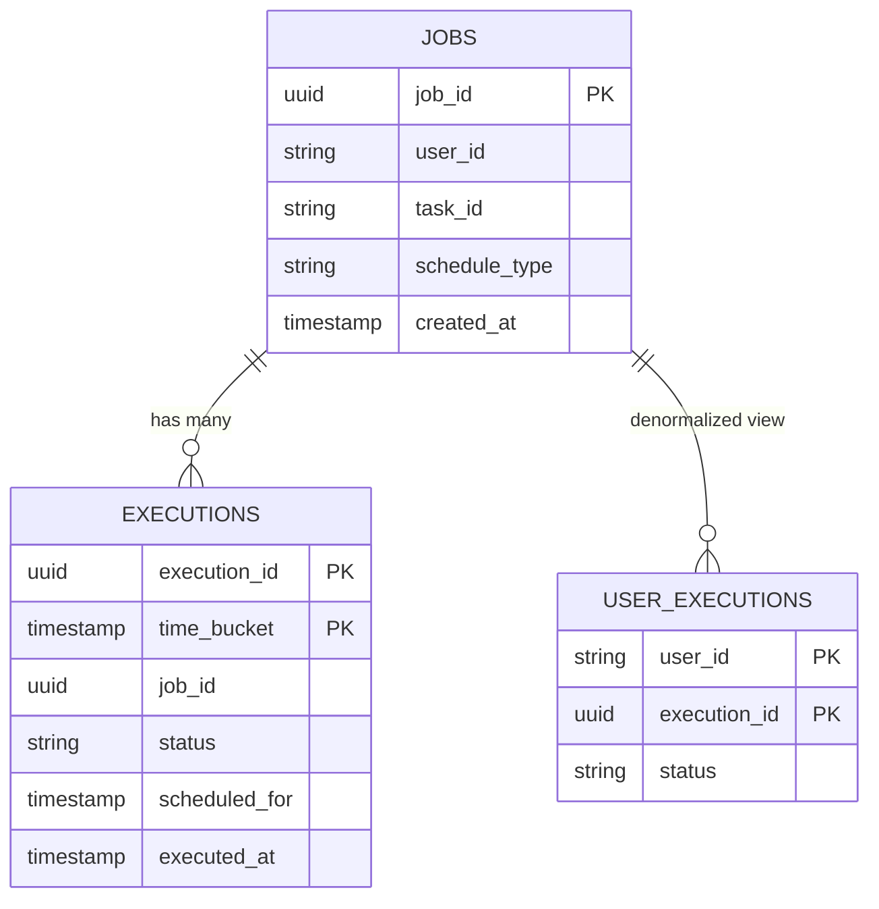
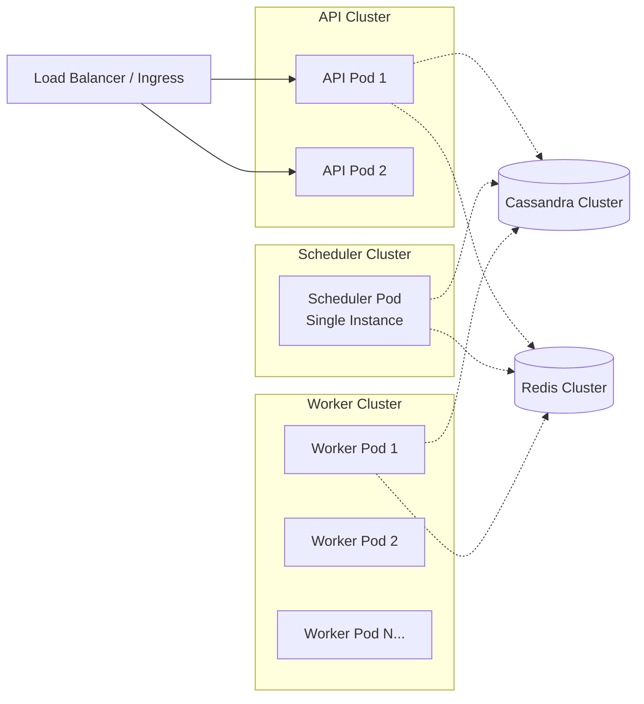

# Job Scheduler Architecture Document

This document outlines the architecture, components, and data flow of the Job Scheduler application using UML diagrams.

## 1. System Component Diagram

The component diagram illustrates the high-level architecture of the system.

## 2. Sequence Diagram: Job Submission & Execution Flow

The sequence diagram explains the two-layer scheduling flow showing interaction among the API, DB, Queue, Scheduler, and Workers.

## 3. Data Model (Entity Relationship)

## 4. Deployment Context

The deployment diagram structure representing the Docker/Kubernetes container orchestrators for horizontal scalability.

## Architecture Design Principles

1. **Two-Layer Scheduling**: Enhances system durability and precision. Cassandra handles persistence and robustness against restarts, while Redis handles sub-second queuing and deduplication.
2. **Horizontal Scalability**: Both API and Worker components are stateless and horizontally scalable. 
3. **Atomic Queue Processing**: Uses Redis sorted sets `queue:pending` and `queue:processing` along with visibility timeouts for safe concurrent consumption by multiple workers.
4. **Retry Logic**: Failed tasks implement an exponential backoff directly within the worker processes before permanently failing the execution.
